<div align="center">

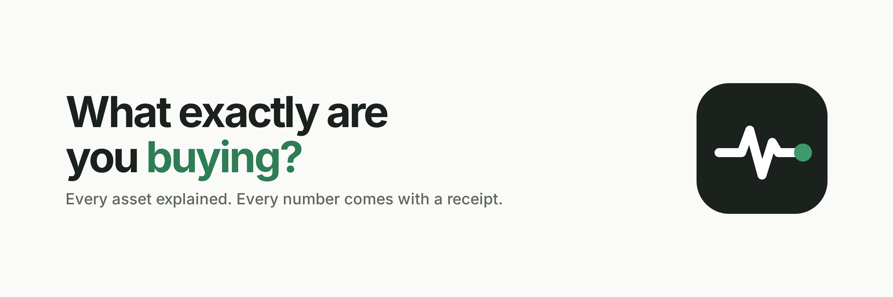

# PULSE

### The verification layer for tokenized markets

**Every asset explained. Every number comes with a receipt.**

[](https://coinmarketcap.com/api/real-world-assets-api/)
[](#)
[](#)


[**Problem**](#-the-problem) · [**Solution**](#-the-solution) · [**Why it's different**](#-why-pulse-is-different) · [**Impact**](#-impact) · [**Architecture**](#-architecture) · [**Workflows**](#-workflows) · [**Proof**](#-proof-its-all-real) · [**Run it**](#-run-it-locally) · [**Whitepaper**](docs/whitepaper/pulse-whitepaper.pdf)

</div>

---

## 👋 Introduction

Tokenized stocks, gold, treasuries and funds are moving on-chain fast. But a ticker is not an instrument. When you search **TSLA** today, you aren't looking at one thing. You're looking at a dozen look-alike tokens, minted by different companies, living on different chains, priced by sources nobody shows you.

**PULSE answers one question before you act: _what exactly are you buying?_**

It resolves any ticker or name to a stable CoinMarketCap identity (`rwa_id`), shows every token, issuer and chain behind that asset on one page (the **RWA Passport**), and attaches a **data receipt** to every important number: the exact CMC endpoint and field it came from, when CMC updated it, when PULSE fetched it, what it cost, and a SHA-256 fingerprint of the response.

> **No number without a source. No missing number dressed up as a real one.**

<div align="center">
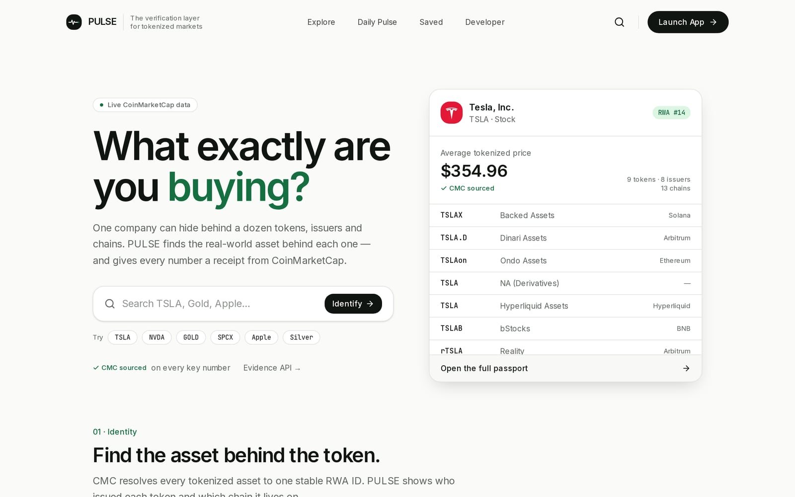
<br/><sub>The landing page answers the question immediately: one asset, its RWA ID, its verified price and every token behind it, all from live CoinMarketCap data.</sub>
</div>

---

## 🔥 The problem

**One ticker. Nine different tokens.** These are real CoinMarketCap figures, not an illustration:

| | |
|---|---|
| Tokenized real-world assets tracked by CoinMarketCap | **7,942** |
| Issuers minting them | **25** |
| Distinct tokens that trade as **Tesla** | **9**, from **8** issuers on **13** chains |
| Tesla tokens CoinMarketCap returns with **no price at all** | **1** (`TSLA.D` → `price: null`) |

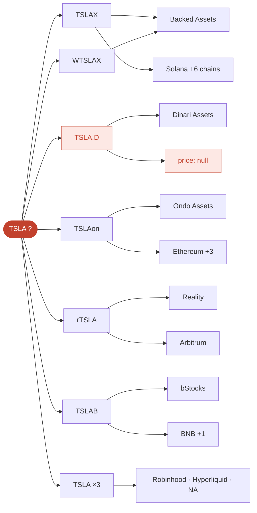

Three failures follow, and they hit everyone, not just crypto natives:

1. **No identity.** Nothing tells you which company, issuer or chain a token really points to. Look-alike names make the wrong pick easy.
2. **No issuer clarity.** The same asset is minted by many companies with different structures. The ticker hides who you are trusting.
3. **No proof behind the numbers.** Prices show up with no source and no timestamp. Some tokens have no price at all, and interfaces that show `$0.00` or quietly drop them are telling you something false.

**The result:** people buy the wrong instrument, or trust a number nobody can verify.

---

## 💊 The solution

**PULSE is the painkiller:** an identity and verification layer built on CoinMarketCap's RWA API.

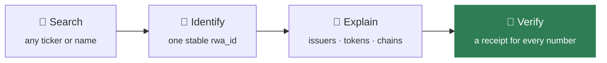

| Feature | What it gives you |
|---|---|
| **RWA Passport** | The underlying asset, its stable RWA ID, rank, company facts, the tokenized aggregate price, and every token mapped to its issuer and chains. |
| **Truth Receipt** | Tap any number to see its endpoint, JSON field path, CMC timestamp vs retrieval time, credit cost, SHA-256 response fingerprint and a reproducible `curl`. |
| **⌘K resolve** | A command palette that resolves any ticker or name through CMC's RWA ID Map (0 credits) and opens its Passport. |
| **Explain this asset** | A plain-English summary built only from the fields CMC returned. No LLM guessing, no buy/sell language. |
| **Daily Pulse** | A 60-second briefing: Fear & Greed, Altcoin Season, global market, and the RWAs you saved, each number with its receipt. |
| **Evidence API** | The same receipts as JSON at `/api/verify`, so scripts and AI agents can verify an answer instead of just repeating it. |

<table>
<tr>
<td width="50%">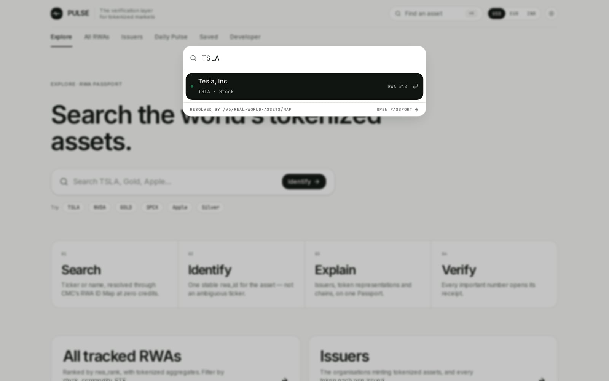<br/><sub><b>Search.</b> ⌘K → "TSLA" → resolved by <code>/v5/real-world-assets/map</code> to RWA #14.</sub></td>
<td width="50%">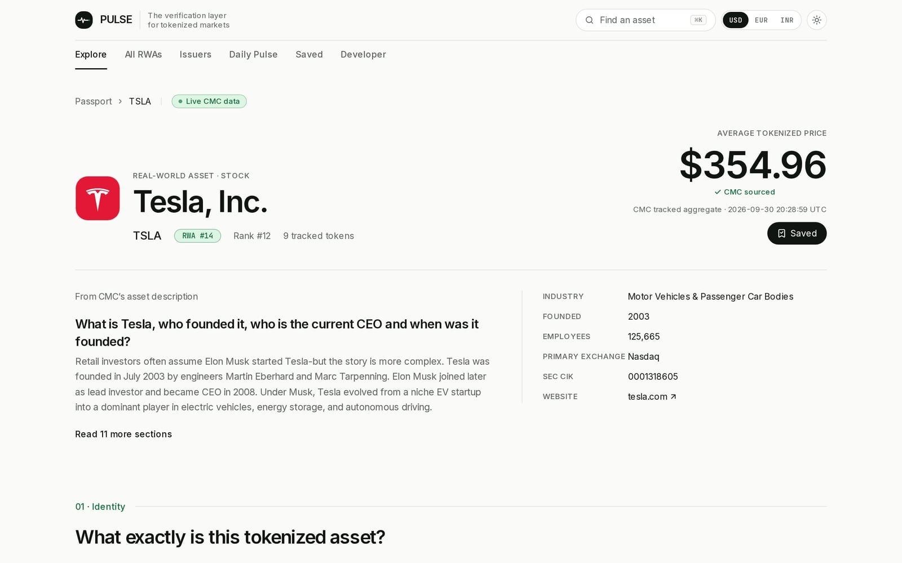<br/><sub><b>RWA Passport.</b> Stable identity, verified aggregate price, company facts from CMC.</sub></td>
</tr>
<tr>
<td width="50%">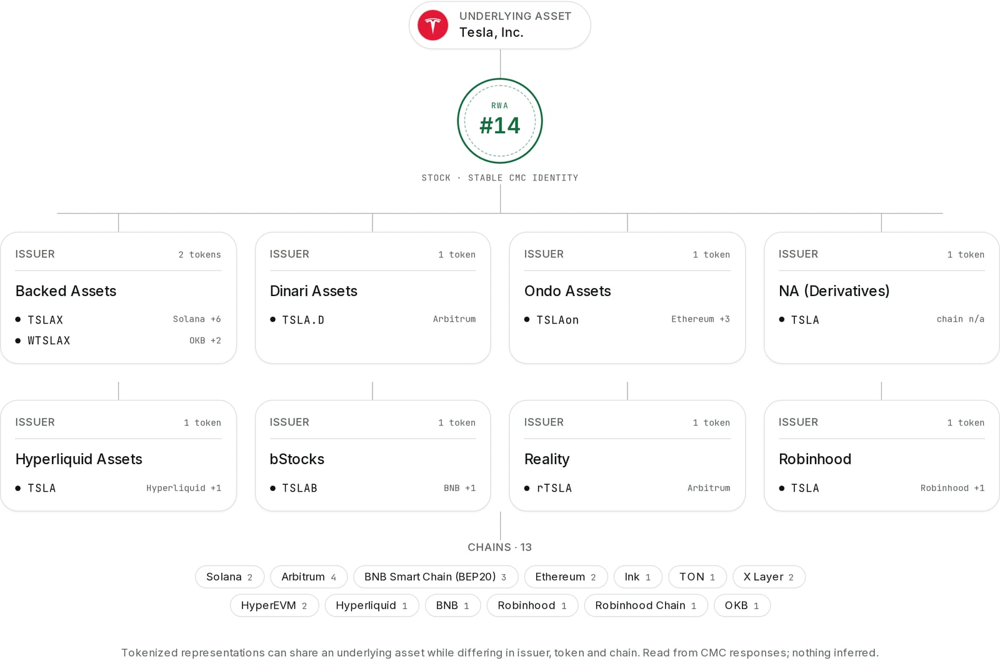<br/><sub><b>Identity map.</b> Underlying asset → RWA ID → each issuer and its tokens → chains.</sub></td>
<td width="50%">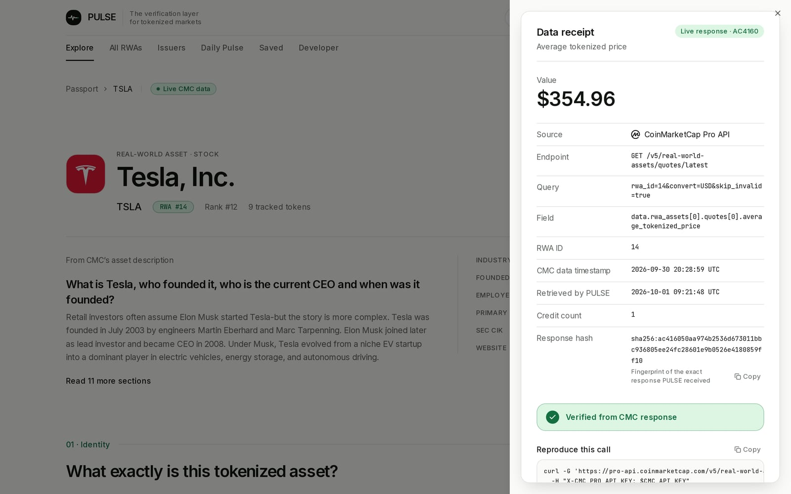<br/><sub><b>Truth Receipt.</b> Endpoint, field, timestamps, credits, SHA-256, "Verified from CMC response".</sub></td>
</tr>
<tr>
<td width="50%">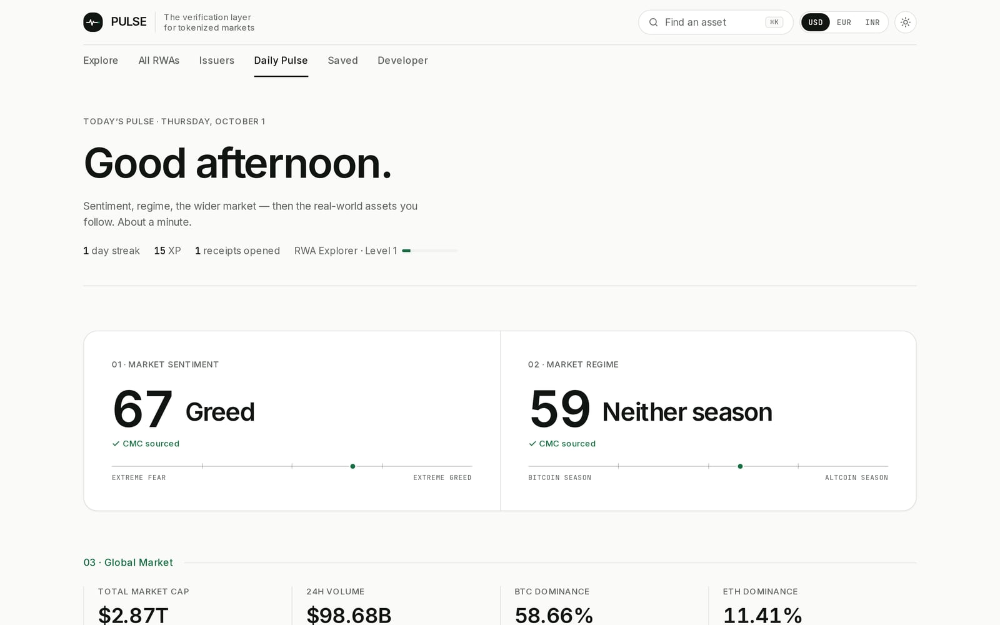<br/><sub><b>Daily Pulse.</b> Market sentiment and regime with receipts, plus your saved RWAs.</sub></td>
<td width="50%">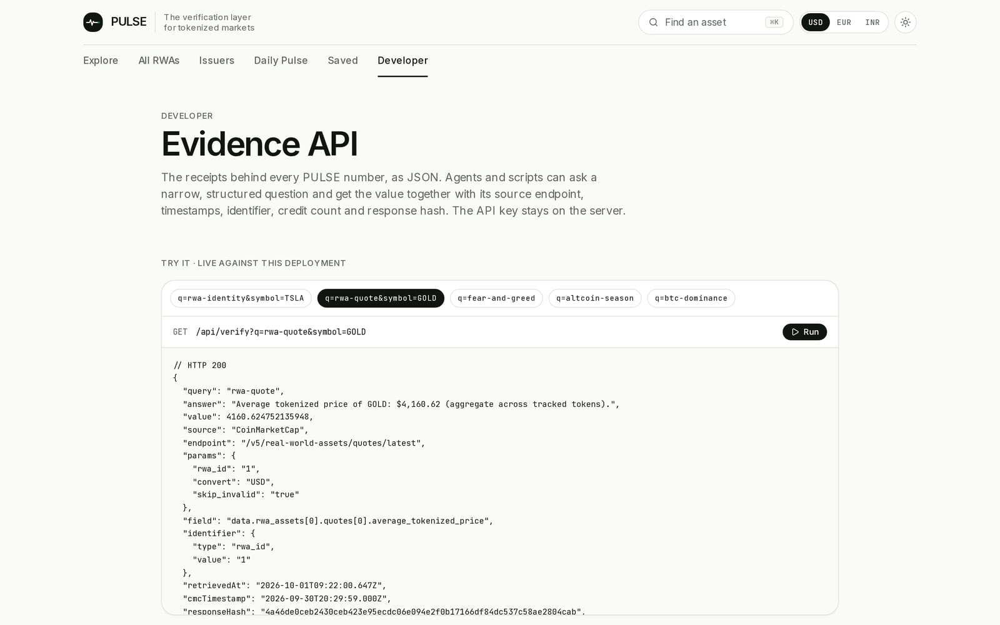<br/><sub><b>Evidence API.</b> <code>/api/verify</code> run live: answer + full receipt as JSON.</sub></td>
</tr>
</table>

---

## ✨ Why PULSE is different

**Not another price tracker.**

| Capability | Typical tracker | **PULSE** |
|---|:---:|:---:|
| Shows a price | ✅ | ✅ |
| Resolves a ticker to one stable RWA identity | — | ✅ |
| Maps every token → issuer → chain on one page | — | ✅ |
| Tells you where **each** number came from (endpoint + field) | — | ✅ |
| Separates CMC's timestamp from retrieval time | — | ✅ |
| Response fingerprint + reproducible call | — | ✅ |
| Never fabricates a missing value; demo data can never show as verified | — | ✅ |
| Same evidence as JSON for AI agents | — | ✅ |

**Design rules PULSE never breaks:**

- **Identity before price.** Every page and URL is keyed by `rwa_id` (`/passport/14`), never by an ambiguous ticker.
- **Provenance on every key value.** Receipts are derived from response metadata, not written by hand, so a number cannot carry a receipt for a response it didn't come from.
- **Absent stays absent.** A field CMC omits renders as "not in CMC data". Nothing is interpolated or defaulted to zero.
- **Honest modes.** Without an API key, pages show clearly labelled **DEMO DATA**, and receipts read `demo`, never `verified`.
- **Grounded language.** No buy/sell signals, no risk scores, no "cheapest venue" claims. PULSE explains and verifies; it does not advise.

---

## 🌍 Impact

> **Not another dashboard. A painkiller for the biggest confusion in tokenized assets.**

| Who | Before PULSE | With PULSE |
|---|---|---|
| **Everyday investors** | Pick between look-alike tickers and hope. | See the real asset, the issuer and the chain *before* clicking buy. |
| **Builders & AI agents** | Scrape prices with no provenance; agents restate numbers they can't check. | One API call returns the answer plus endpoint, timestamps and a response hash. |
| **Analysts & researchers** | Manually cross-reference explorers, issuer sites and price feeds. | One Passport per asset, every value traceable to a CMC response. |
| **Tokenized markets** | Trust erodes when nobody can say what a token represents. | A transparent identity layer on top of CoinMarketCap's RWA data, open to everyone. |

### How it fits into daily life

- **Before you buy:** search the ticker your app showed you. Confirm it's the asset you think it is, see who issued that specific token, and check which chain it lives on.
- **When a price looks off:** open its receipt and see exactly when CMC last updated it, and whether it's an aggregate across tokens or a single token's price.
- **Your morning check:** Daily Pulse gives market sentiment, the market regime and your saved RWAs in about a minute.
- **In your tools:** point a script, a bot or an AI agent at `/api/verify` and get verifiable answers instead of guesses.

---

## 🏗 Architecture

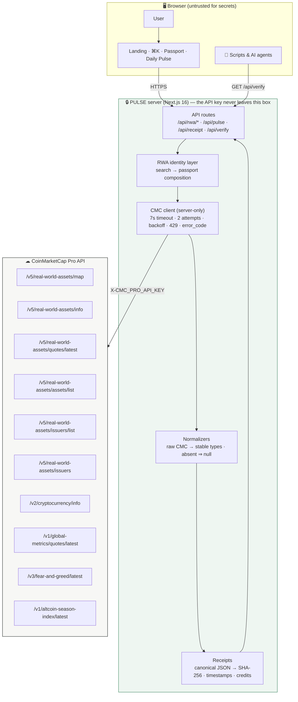

**Key properties**

- **Bounded cost:** a Passport costs **at most 4 CMC calls**, however many tokens the asset has. Issuers come straight from `tokens[].issuer_id`, so there's no per-issuer fan-out. Identity resolution through the RWA ID Map costs **0 credits**.
- **Cache aligned to CMC's update frequency:** quotes 60s · metadata and issuers 15 min · crypto metadata 24h · map 5 min (exact) / 1h (name index).
- **Fails independently:** each data source degrades on its own into a clear "unavailable" state; Daily Pulse streams its first byte in ~0.1s even when CMC is unreachable.

---

## 🔁 Workflows

### 1 · Search → RWA Passport

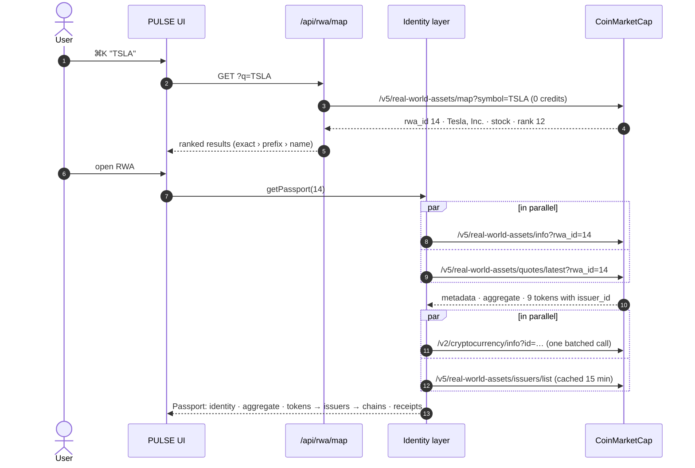

### 2 · Every number → its receipt

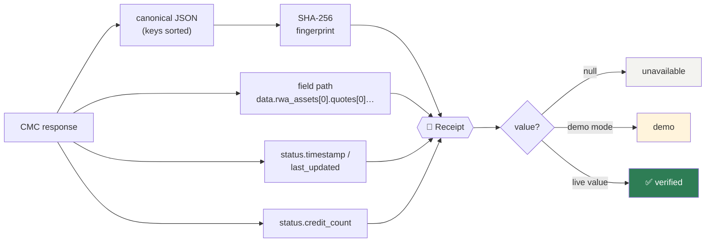

### 3 · AI agent verification (Evidence API)

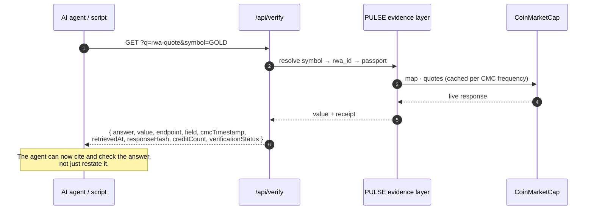

### 4 · Daily Pulse: independent, never blank

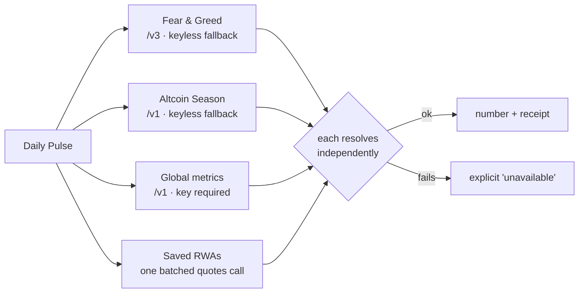

---

## 🧪 Proof: it's all real

Every endpoint PULSE depends on was called live against the CoinMarketCap Pro API. Raw responses, each with its SHA-256, are in [`evidence/live/`](evidence/live/). No API key appears in any file.

| Endpoint | HTTP | Credits | CMC `elapsed` |
|---|:---:|:---:|:---:|
| `/v5/real-world-assets/map` | ✅ 200 | 0 | 1 ms |
| `/v5/real-world-assets/info` | ✅ 200 | 1 | 3 ms |
| `/v5/real-world-assets/quotes/latest` | ✅ 200 | 1 | 5 ms |
| `/v5/real-world-assets/assets/list` | ✅ 200 | 1 | 10 ms |
| `/v5/real-world-assets/issuers/list` | ✅ 200 | 1 | 3 ms |
| `/v5/real-world-assets/issuers` | ✅ 200 | 1 | 4 ms |
| `/v2/cryptocurrency/info` | ✅ 200 | 1 | 11 ms |
| `/v1/global-metrics/quotes/latest` | ✅ 200 | 1 | 11 ms |
| `/v3/fear-and-greed/latest` | ✅ 200 | 1 | 2 ms |
| `/v1/altcoin-season-index/latest` | ✅ 200 | 1 | 4 ms |
| **Total** | **10 / 10** | **9** | |

<sub>Captured September 30, 2026 with <code>npm run evidence</code>. <code>elapsed</code> is CMC-reported server time. <code>/v5/real-world-assets/market-pairs/list</code> is intentionally not used (Growth plan and above), and the core flow doesn't need it.</sub>

**Quality gates:** 31 unit tests (normalization of documented *and* live response shapes, `rwa_id` ranking, receipts, deterministic hashing, formatting, null handling) · ESLint + `tsc --noEmit` clean · production build passing.

**What testing against the live API taught us** (full write-up in [FEEDBACK.md](FEEDBACK.md) and the [whitepaper](docs/whitepaper/pulse-whitepaper.pdf)):

- Converted aggregates arrive in a `quotes[]` array; flat fields stay USD, and token prices are always USD. PULSE labels the currency it actually received.
- Live tokens carry `issuer_id`/`issuer_name`. That let us delete a per-issuer fan-out and bound a Passport at 4 calls.
- `tradfi_markets[]` items have venue + link but no price, so PULSE never invents one.
- `status.error_code` is `"0"` (string) on some endpoints and `0` (number) on others; an unknown `rwa_id` returns HTTP 400, not 404.

---

## 🚀 Run it locally

```bash
git clone https://github.com/notwen123/PULSE.git
cd PULSE
npm install
cp .env.example .env.local     # add your CMC_API_KEY
npm run dev                    # http://localhost:3000
```

| Command | What it does |
|---|---|
| `npm run dev` | Development server |
| `npm test` | 31 unit tests (Vitest) |
| `npm run lint` | ESLint + TypeScript |
| `npm run build` | Production build |
| `npm run evidence` | Capture live CMC responses into `evidence/live/` (needs `CMC_API_KEY`) |

### Environment variables

| Variable | Required | Notes |
|---|---|---|
| `CMC_API_KEY` | For live data | CoinMarketCap Pro API key. **Server-side only**, sent as `X-CMC_PRO_API_KEY`. Never prefix with `NEXT_PUBLIC_`. |
| `CMC_API_BASE_URL` | No | Defaults to `https://pro-api.coinmarketcap.com`. |

Without a key, PULSE still runs: RWA pages show labelled demo data, and Fear & Greed / Altcoin Season load live through CMC's keyless public API.

### Deploy to Vercel

1. Import the repo at [vercel.com/new](https://vercel.com/new). Vercel detects Next.js; `vercel.json` pins the framework and the `iad1` region.
2. Add `CMC_API_KEY` for Production and Preview.
3. Deploy.

---

## 🎬 Demo flow (90 seconds)

1. Open **`/`** and see the live Tesla Passport preview: RWA #14, the verified price, all 9 tokens.
2. Press **⌘K**, type **TSLA**, and watch it resolve via the RWA ID Map to **RWA #14**.
3. On the **Passport**, scroll to **Identity**: Tesla → RWA #14 → 8 issuers → 9 tokens → 13 chains.
4. Click the **average tokenized price** to open the **Truth Receipt**: endpoint, field, timestamps, credits, SHA-256.
5. Open **Daily Pulse** for live sentiment and regime, each with a receipt.
6. Open **Developer** and run `rwa-quote` for GOLD against the live **Evidence API**.

---

## 🧭 Evidence API

```bash
curl 'http://localhost:3000/api/verify?q=rwa-quote&symbol=GOLD'
```

```json
{
  "query": "rwa-quote",
  "answer": "Average tokenized price of GOLD: $4,156.57 (aggregate across tracked tokens).",
  "value": 4156.572288375992,
  "source": "CoinMarketCap",
  "endpoint": "/v5/real-world-assets/quotes/latest",
  "params": { "rwa_id": "1" },
  "field": "data.rwa_assets[0].quotes[0].average_tokenized_price",
  "identifier": { "type": "rwa_id", "value": "1" },
  "retrievedAt": "2026-09-30T19:14:35.720Z",
  "cmcTimestamp": "2026-09-30T19:12:59.000Z",
  "responseHash": "<SHA-256 of the canonical CMC response>",
  "creditCount": 1,
  "verificationStatus": "verified",
  "mode": "live"
}
```

<sub>Values from the live capture in <code>evidence/live/rwa-quotes-latest.json</code>.</sub>

Queries: `rwa-identity` · `rwa-quote` (by `symbol` or `rwa_id`, optional `convert`) · `fear-and-greed` · `altcoin-season` · `btc-dominance`. PULSE doesn't proxy or replace CMC's MCP server; it adds a provenance layer any agent can call as a plain HTTP tool.

---

## 🧱 Tech stack & structure

**Next.js 16 · React 19 · TypeScript (strict) · Tailwind CSS v4 · Radix primitives · Motion · Vitest**. 4,903 lines of TypeScript.

```text
src/
├─ app/
│  ├─ (marketing)/         landing page
│  ├─ (app)/               Explore · Passport · All RWAs · Issuers · Daily Pulse · Saved · Developer
│  └─ api/                 rwa/{map,info,quotes,list,issuers,issuer,passport} · pulse · receipt · verify
├─ lib/
│  ├─ api/cmc.ts           the only CMC client (server-only, retries, error taxonomy)
│  ├─ api/rwa.ts           identity layer: search + passport composition
│  ├─ api/normalizers.ts   raw CMC → stable types (pure, unit-tested)
│  ├─ receipt.ts           canonical JSON → SHA-256 receipts
│  └─ api/verify.ts        Evidence API
├─ components/             passport, receipt, search palette, landing
tests/                     normalizers · receipts/hashing · formatting/explain
evidence/live/             real CMC responses with SHA-256
docs/whitepaper/           PULSE whitepaper (LaTeX + PDF)
```

---

## 📚 Documentation

| Document | What's inside |
|---|---|
| [**Whitepaper (PDF)**](docs/whitepaper/pulse-whitepaper.pdf) | Design goals, resolution & evidence calculus, architecture, live evaluation, limitations |
| [ENDPOINTS_USED.md](ENDPOINTS_USED.md) | Every CMC endpoint: purpose, where it's used, plan/credits, fields read, caching |
| [FEEDBACK.md](FEEDBACK.md) | Honest API feedback: what was easy, what diverged from the docs, what would help developers |
| [evidence/live/](evidence/live/) | Raw live CMC responses with capture time and SHA-256 |

---

## 🔐 Security

- The CMC key lives only in `src/lib/api/cmc.ts`, which imports `server-only`; the build fails if client code imports it.
- The key is never logged, never returned by any route, never written into receipts or evidence files.
- `.env*.local` is git-ignored; `.env.example` holds no values.
- Route handlers validate `rwa_id`, `issuer_id`, query length, `asset_type` and `convert` before calling CMC.

## ⚖️ Responsible use

PULSE explains CMC-sourced data. It gives no investment advice, no buy/sell signals and no risk scores. A response fingerprint proves which payload a number came from; it does not prove the market value is correct, and the interface says so.

## 📄 License & attribution

MIT, see [LICENSE](LICENSE). This repository began as an open-source MIT-licensed Next.js dashboard scaffold; its CoinGecko data layer and pages were replaced by the CMC RWA product described here. Market data © CoinMarketCap.

<div align="center">
<br/>

<br/>
<b>Every asset explained. Every number comes with a receipt.</b>
<br/><sub>Built for the <b>Build with CMC: API Hackathon</b> · #BuildwithCMC</sub>
</div>
